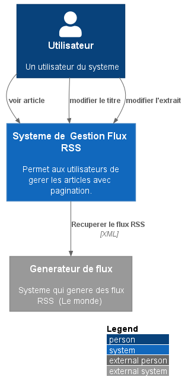
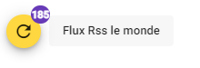
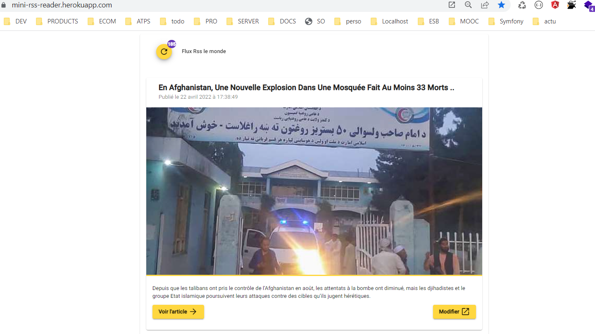
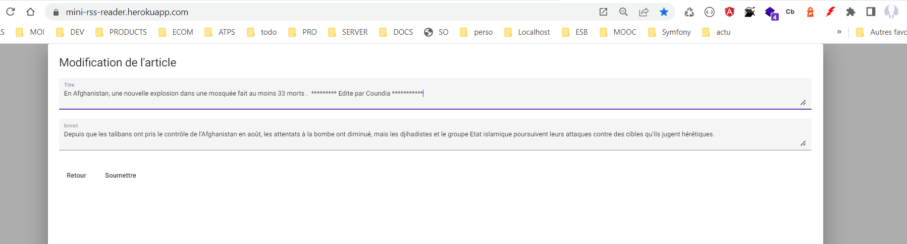
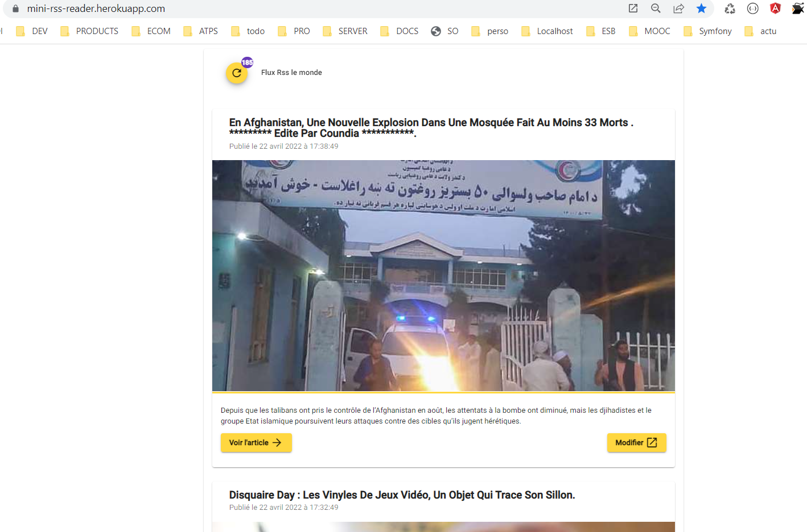
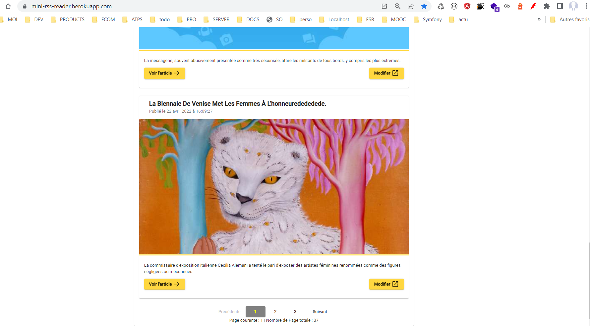
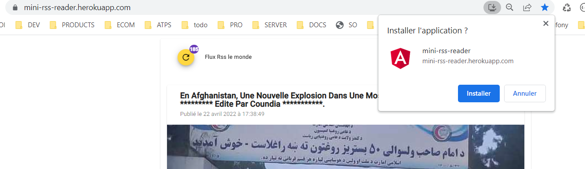

# MINI PROJET FLUX RSS

# Context du projet

MINI PROJET FLUX RSS

PROGRAMME SOFTWARE ENGINEERING EDACY - DIGITAL AFRICA

L’objectif de ce projet est de développer un lecteur de flux RSS

By Papa COUNDIA

## Objectif

L’objectif de ce projet est de développer un lecteur de flux RSS

## Besoins fonctionnels

- Récupérer le flux du 'le monde' [https://www.lemonde.fr/rss/en_continu.xml](https://www.lemonde.fr/rss/en_continu.xml)
- l'afficher sous un format listing avec image et extrait
- Prévoir la pagination
- Pouvoir modifier le titre
- Pouvoir modifier l'extrait

## Contraintes

- Langage front imposé : Angular
- Langage back : au choix
- Délai : 2 jours, à rendre au plus tard le jeudi 21 avril à 12h00 GMT

## Livrables

- Repo Github du projet
- Un README qui explique les technologies utilisées et le processus de lancement de l’application
- Un bonus pour ceux qui pourront partager un lien ou on peut tester (par exemple sur Heroku)

## Technologies Utilisées pour la realisation du miniprojet

## Modélisation : [ModelC4](https://c4model.com/)

La modélisation C4 (de l'anglais « C4 model ») est une technique de notation graphique allégée pour la modélisation
d'architectures logicielles1,2. Elle est basée sur la décomposition structurelle d'un système en conteneurs et
composants. La décomposition plus détaillée de ces éléments architecturaux peut alors s'appuyer sur des techniques de
modélisation existantes telles que le langage de modélisation unifié (UML) ou les diagrammes entité-associations.

[Source definition](https://fr.wikipedia.org/wiki/Mod%C3%A9lisation_C4)

# Terminologies du modelC4

### `Person`

Person : les 'Person' sont les différents utilisateurs de notre système .

### `System`

Un système est le plus haut niveau d'abstraction du modelC4 et décrit les Besoins fonctionels des utilisateurs (Person)

### `Container`

Un `Container` représenté quelque chose qui héberge du code ou des données. Un conteneur est quelque chose qui doit être
exécuté pour que le système fonctionne. En termes réels, un conteneur ressemble

### `Composant`

Un "composant" est simplement un regroupement de fonctionnalités connexes encapsulées derrière une interface bien
définie.

### `Code`

Representé notre MCD (Model conceptuel de données) .

### Model

# Context

## Container (Architecture)

### Backend  ([SPRING](https://spring.io/why-spring))

Spring est un framework Java open source .

- Leger
- Development rapide
- Bonne communauté
- Complet (Beaucoup d'outils)
-

# Lancer le backend-end

1- Option 1 : passer par la release

- télécharger le
  binaire :  `wget https://github.com/coundia/mini_rss_reader_spring/releases/download/v1.1/mini_rss_reader_spring-v1.1.jar`
- Configurer le JRE de JAVA
- `java -jar mini_rss_reader_spring-v1.1.jar`

2- Option 2 : passer maven

- cloner le projet : `git clone https://github.com/coundia/mini_rss_reader_spring`
- `mvn spring-boot:run`

- Api Backend
  - gerer les articles (GET,PATCH,POST,POST) : Lister , modifier etc
  - [https://mini-rss-api.herokuapp.com/api/v1/rss/items](https://mini-rss-api.herokuapp.com/api/v1/rss/items)
  - Recuperer les articles depuis le monde et les mettre dans notre base de donnees
  - [https://mini-rss-api.herokuapp.com/api/v1/rss/refresh](https://mini-rss-api.herokuapp.com/api/v1/rss/refresh)
  - Verifier status du serveur (UP)
  - [https://mini-rss-api.herokuapp.com/api/v1/rss/status](https://mini-rss-api.herokuapp.com/api/v1/rss/status)

### front end (angular)

1- Option 1 : passer par la release

- télécharger le dist : `wget https://github.com/coundia/mini-rss-reader/releases/download/v1.1/distV1.2.zip`
- décompresser le zip : `unzip distV1.2.zip`
- SI vous n'avez de serveur Apache ou NGINX
- `npm install --global http-server`
- `cd distV1`
- `http-server -o`

2- Option 2 : passer npm

- cloner le projet : `git clone https://github.com/coundia/mini-rss-reader`
- `npm install`
- `ng serve`

## Lien de test

- Front-end
- [https://mini-rss-reader.herokuapp.com/](https://mini-rss-reader.herokuapp.com/)

# Guide utilisateurs

- Boutton pour recuperer les derniers articles depuis le monde.fr

- Listes articles

- Modifier titre ou Description

- Résultat apres réactualisation de la page

- Pagination

- PWA : Pour desktop et Mobile

Lien Swagger

[https://mini-rss-api.herokuapp.com/swagger-ui/index.html](https://mini-rss-api.herokuapp.com/swagger-ui/index.html)

- Lien DEMO derniere version :    

[https://mini-rss-reader.herokuapp.com/](https://mini-rss-reader.herokuapp.com/)

- P. Coundia
- PROGRAMME SOFTWARE ENGINEERING EDACY - DIGITAL AFRICA

