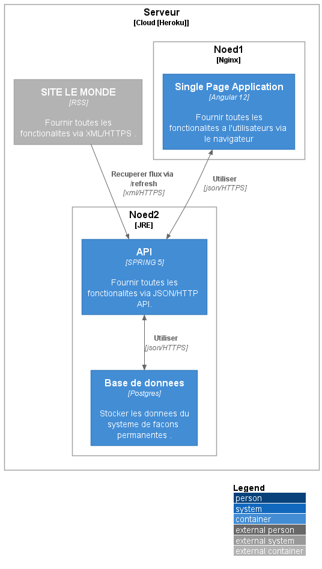

# MINI PROJET FLUX RSS

# Introduction

MINI PROJET FLUX RSS :
PROGRAMME SOFTWARE ENGINEERING EDACY - DIGITAL AFRICA

## Objectif

L’objectif de ce mini projet est de développer un lecteur de flux RSS

## Besoins

- récupérer le flux du 'le monde' [https://www.lemonde.fr/rss/en_continu.xml](https://www.lemonde.fr/rss/en_continu.xml)
- l'afficher sous un format listing avec image et extrait
- prévoir la pagination
- pouvoir modifier le titre
- pouvoir modifier l'extrait

## Contraintes

- Langage front imposé : Angular
- Langage back : au choix
- Délai : 2 jours, à rendre au plus tard le jeudi 21 avril à 12h00 GMT

## Livrables

- Repo Github du projet
- Un README qui explique les technologies utilisées et le processus de lancement de l’application
- Un bonus pour ceux qui pourront partager un lien ou on peut tester (par exemple sur Heroku)

# Terminologies du modelC4

### `Person`

Person : les 'Person' sont les différents utilisateurs de  notre système .

### `System`

Un système est le plus haut niveau d'abstraction du modelC4 et décrit les Besoins fonctionels des utilisateurs (Person)

### `Container`

Un `Container` représente quelque chose qui héberge du code ou des données. Un conteneur est quelque chose qui doit être
exécuté pour que le système fonctionne. En termes réels, un conteneur ressemble

### `Composant`

Un "composant" est simplement un regroupement de fonctionnalités connexes encapsulées derrière une
interface bien définie.

### `Code`

   notre MCD (Model conceptuel de données) .

## Lancer le projet
- Backend (spring)
- mvn spring-boot:run

- front end (angular)
- npm  install
- ng serve

## Lien de test
- front end
- https://mini-rss-reader.herokuapp.com/

- Backend
- https://mini-rss-api.herokuapp.com/api/v1/rss/items
- https://mini-rss-api.herokuapp.com/api/v1/rss/refresh
- https://mini-rss-api.herokuapp.com/api/v1/rss/status

## MODEL C4

#Context

## Architecture

by coundia
